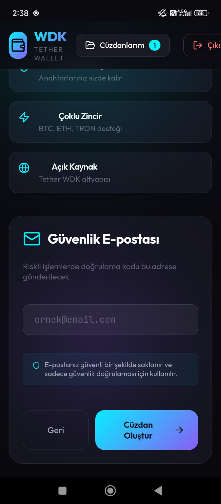
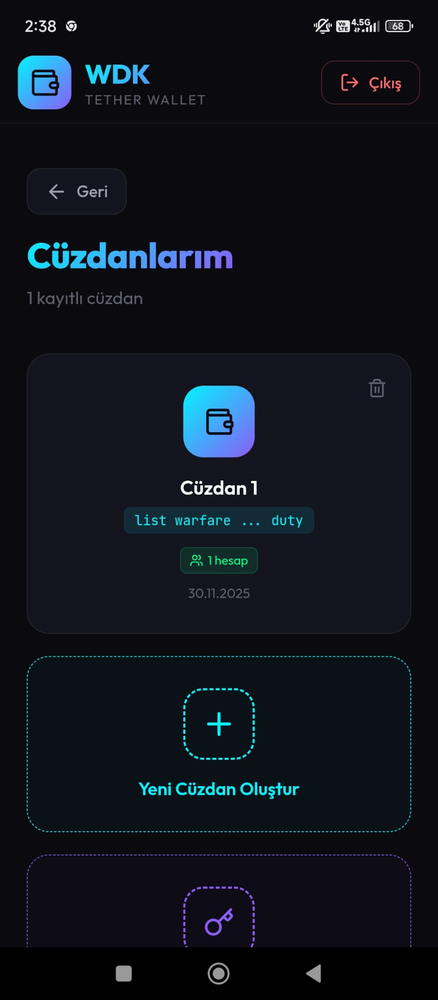
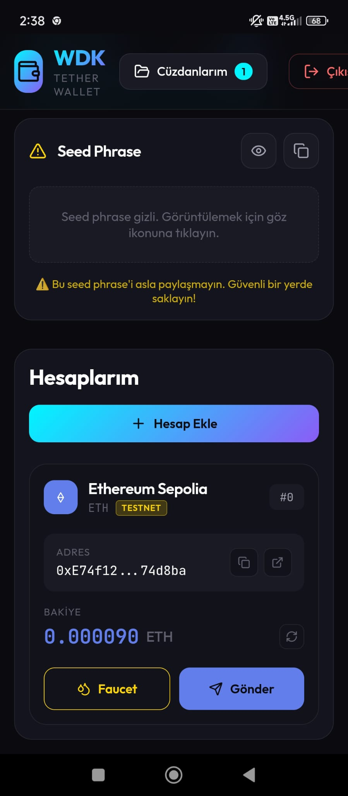
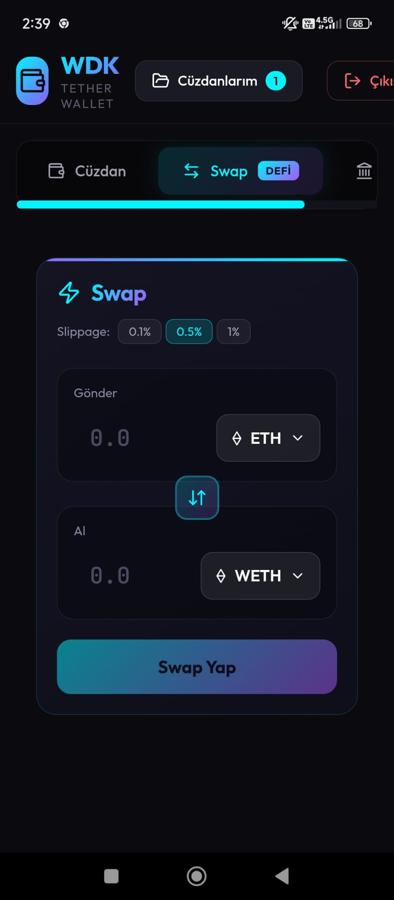
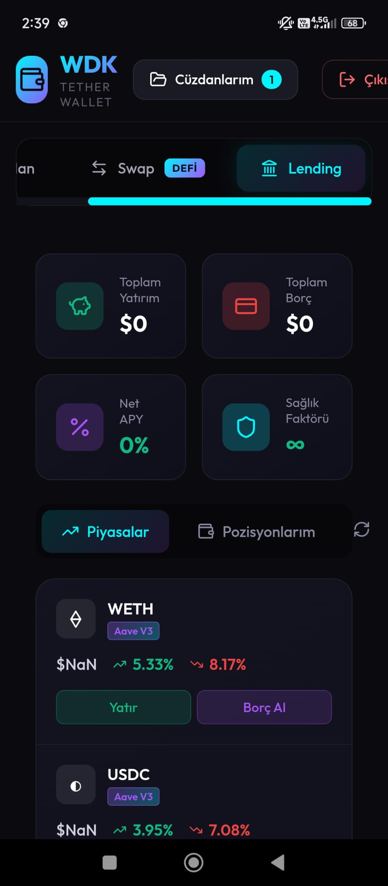
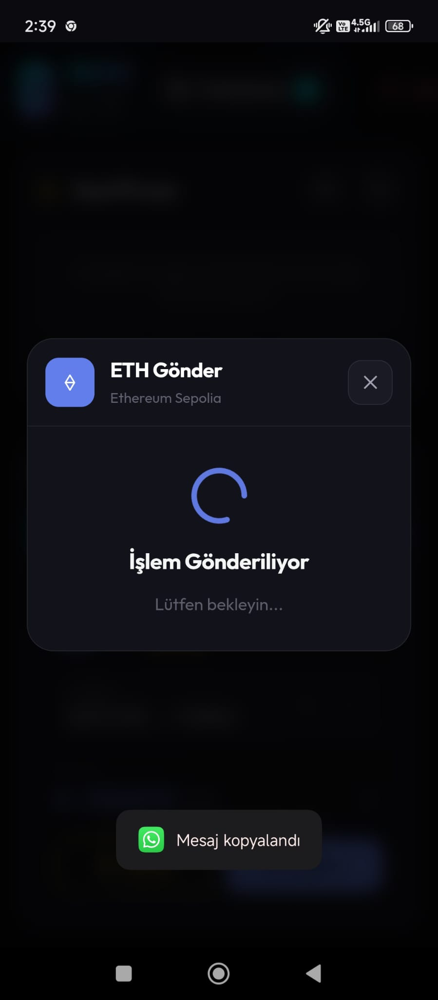
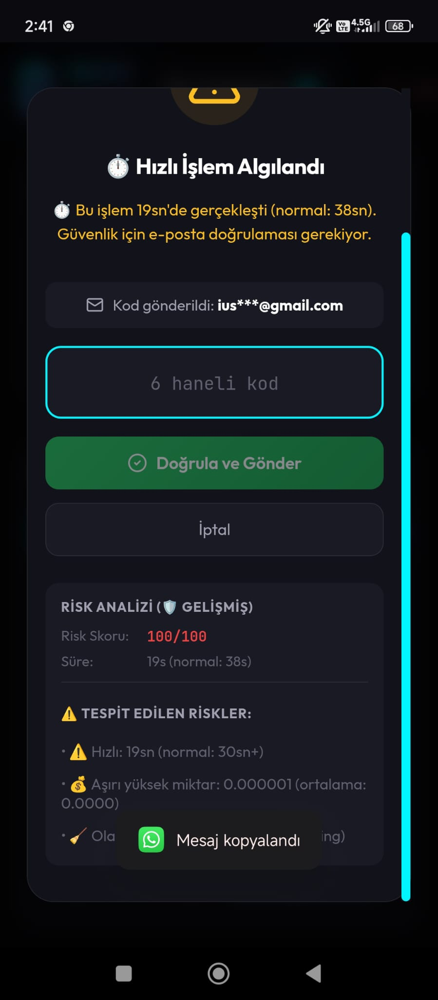
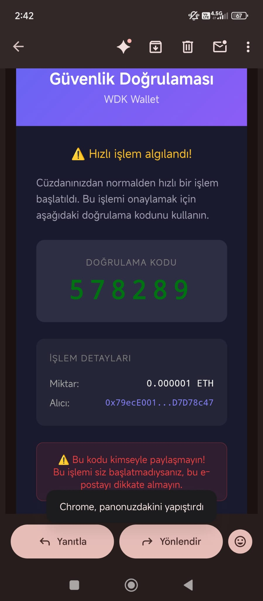

# 🛡️ WDK Crypto Wallet

**Yapay Zeka Destekli Güvenli Kripto Cüzdanı**

Tether WDK (Wallet Development Kit) altyapısı üzerine inşa edilmiş, **davranışsal güvenlik sistemi** içeren yenilikçi bir kripto cüzdan uygulaması.

---

## 📸 Ekran Görüntüleri

### Cüzdan Oluşturma


### Ana Dashboard


### Hesap Detayları


### Transfer İşlemi


### Güvenlik Uyarısı


### E-posta Doğrulaması


### Risk Analizi


### İşlem Onayı


### Başarılı İşlem


---

## ✨ Özellikler

### 🔐 Güvenlik
- **AI Destekli Davranış Analizi** - Google Gemini ile anormal aktivite tespiti
- **E-posta Doğrulaması** - Şüpheli işlemlerde 2FA
- **Sweeping Pattern Tespiti** - Fon boşaltma girişimlerini engelleme
- **Gece Saati Koruması** - Olağandışı saatlerde ekstra güvenlik

### 💼 Cüzdan
- **Çoklu Zincir Desteği** - Ethereum, Bitcoin, TRON
- **Self-Custody** - Anahtarlar tamamen kullanıcıda
- **12 Kelime Seed Phrase** - BIP39 standardı

### 📱 Kullanıcı Deneyimi
- **PWA Desteği** - Mobil uygulama gibi kullanım
- **Modern UI** - Karanlık tema, animasyonlar
- **Responsive Tasarım** - Her cihazda mükemmel görünüm

---

## 🛡️ Davranışsal Güvenlik Sistemi

Sistem kullanıcının normal davranış paternlerini öğrenir ve anormal aktiviteleri tespit eder:

| Risk Faktörü | Açıklama | Risk Seviyesi |
|--------------|----------|---------------|
| ⚡ Çok Hızlı İşlem | < 15 saniye | Kritik |
| 💰 Yüksek Miktar | > 10x ortalama | Kritik |
| 📍 Yeni Adres | İlk kez gönderim | Orta-Yüksek |
| 🌙 Gece Saati | 00:00-06:00 | Orta-Yüksek |
| 🧹 Sweeping | Hızlı fon boşaltma | Kritik |
| 🤖 Bot Şüphesi | Sıfır etkileşim | Kritik |

**Risk Skoru 50+ = E-posta doğrulaması zorunlu**

---

## 🚀 Kurulum

### Gereksinimler
- Node.js 18+
- npm veya yarn

### Backend

```bash
cd backend
npm install
cp .env.example .env
# .env dosyasını düzenle
npm start
```

### Frontend

```bash
cd frontend
npm install
npm run dev
```

### Environment Variables

**Backend (.env):**
```env
NODE_ENV=production
PORT=3001
GEMINI_API_KEY=your_gemini_api_key
EMAILJS_SERVICE_ID=your_service_id
EMAILJS_TEMPLATE_ID=your_template_id
EMAILJS_PUBLIC_KEY=your_public_key
FRONTEND_URL=https://your-frontend.netlify.app
```

**Frontend (.env):**
```env
VITE_API_URL=https://your-backend.onrender.com
VITE_EMAILJS_SERVICE_ID=your_service_id
VITE_EMAILJS_TEMPLATE_ID=your_template_id
VITE_EMAILJS_PUBLIC_KEY=your_public_key
```

---

## 🏗️ Teknik Altyapı

### Frontend
- **React 18** + Vite
- **Framer Motion** - Animasyonlar
- **Lucide Icons** - İkonlar
- **CSS Modules** - Styling

### Backend
- **Node.js** + Express
- **SQLite** - Veritabanı
- **Google Gemini AI** - Davranış analizi
- **EmailJS** - E-posta servisi

### Blockchain
- **Tether WDK SDK**
- Ethereum (Sepolia Testnet)
- Bitcoin (Testnet)
- TRON (Testnet)

---

## 📡 API Endpoints

### Cüzdan
| Method | Endpoint | Açıklama |
|--------|----------|----------|
| POST | `/api/wallet/generate` | Yeni cüzdan oluştur |
| POST | `/api/wallet/import` | Mevcut cüzdan yükle |
| POST | `/api/wallet/account` | Hesap oluştur |
| GET | `/api/wallet/balance/:sessionId/:accountId` | Bakiye sorgula |
| POST | `/api/wallet/send` | Transfer gönder |

### Güvenlik
| Method | Endpoint | Açıklama |
|--------|----------|----------|
| POST | `/api/security/pre-sign` | İşlem öncesi güvenlik kontrolü |
| POST | `/api/security/email/register` | E-posta kaydet |
| POST | `/api/security/email/verify` | Doğrulama kodu kontrol |
| GET | `/api/security/profile/:sessionId` | Güvenlik profili |

---

## 🌐 Deploy

### Backend (Render.com)
1. GitHub reposunu bağla
2. **Root Directory:** `backend`
3. **Build Command:** `npm install`
4. **Start Command:** `node server.js`
5. Environment variables ekle
6. Disk ekle: `/data` (1GB)

### Frontend (Netlify)
1. GitHub reposunu bağla
2. **Base Directory:** `frontend`
3. **Build Command:** `npm run build`
4. **Publish Directory:** `frontend/dist`
5. Environment variables ekle

---

## 🔒 Güvenlik Senaryosu

### Hesap Ele Geçirildi
Saldırgan seed phrase'i ele geçirdi ve hızlıca fonları boşaltmak istiyor:

1. ⚠️ Sistem 5 saniyede yapılan işlemi tespit eder
2. ⚠️ Bilinmeyen adrese yüksek miktar transfer algılar
3. 🔴 Risk skoru: 85/100
4. 📧 E-posta doğrulaması zorunlu hale gelir
5. ❌ Saldırgan, cüzdan sahibinin e-postasına erişemez
6. ✅ Fonlar korunur!

---

## 📄 Lisans

MIT License

---

## 👥 Katkıda Bulunanlar

- Tether WDK Team
- Google Gemini AI

---

**🛡️ Anahtarlarınız sizde, güvenliğiniz yapay zekada.**
